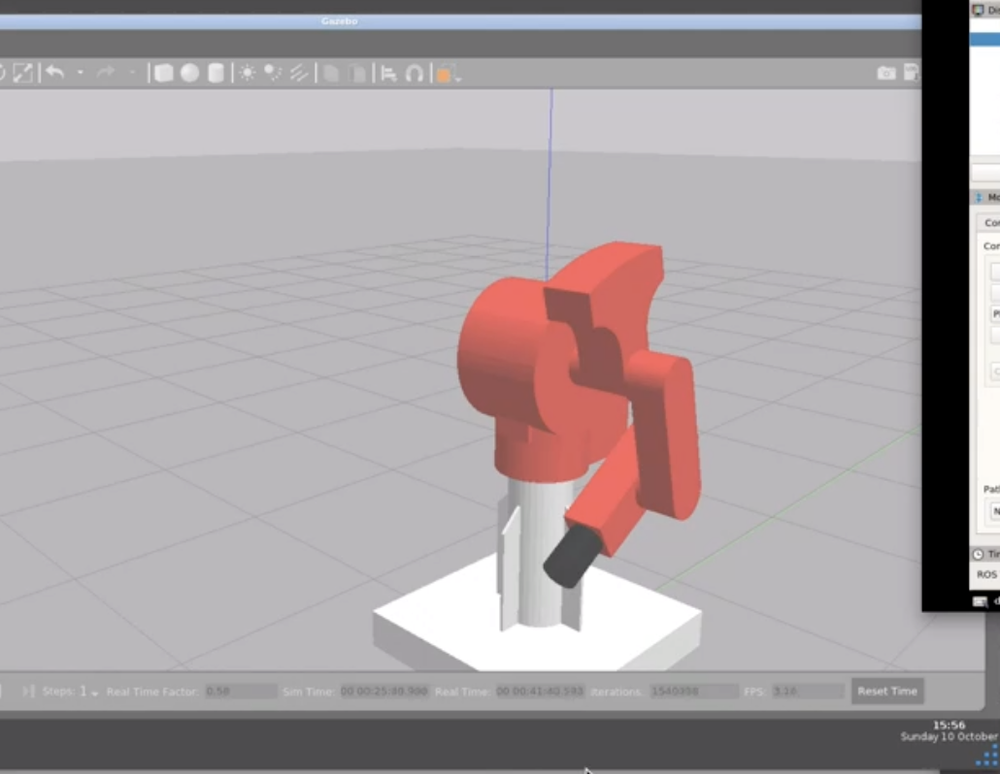
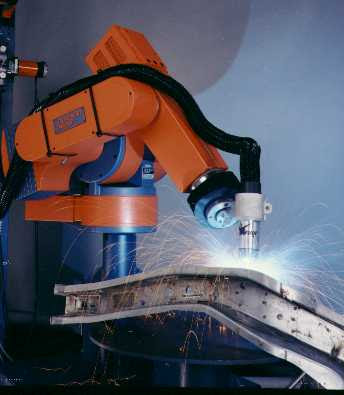

# A set of ROS Packages for simulating and controlling the *American Robot* Merlin MR6500 Robotic Arm 
This package provides:
*  URDF Description
*  Hardware Interface
*  Gazebo Setup
*  MoveIt Configuration

https://www.automationdirect.com/adc/shopping/catalog/motion_control/stepper_systems/stepper_drives/dm542e?gclid=CjwKCAjwk6-LBhBZEiwAOUUDp3MxPbv2CRYGqz6yJRTjKBTM930A82qP2HWefs19mRzff58xXHp5CBoCvp8QAvD_BwE

 go into the move it controller manager XML file and add the line
 <arg name="execution_type" default="unused"/>

  after the move it config has been generated change the controller name in Ross controllers.Yamo from arm controller to Merlin/arm controller

  read this
  https://medium.com/@tahsincankose/custom-manipulator-simulation-in-gazebo-and-motion-planning-with-moveit-c017eef1ea90