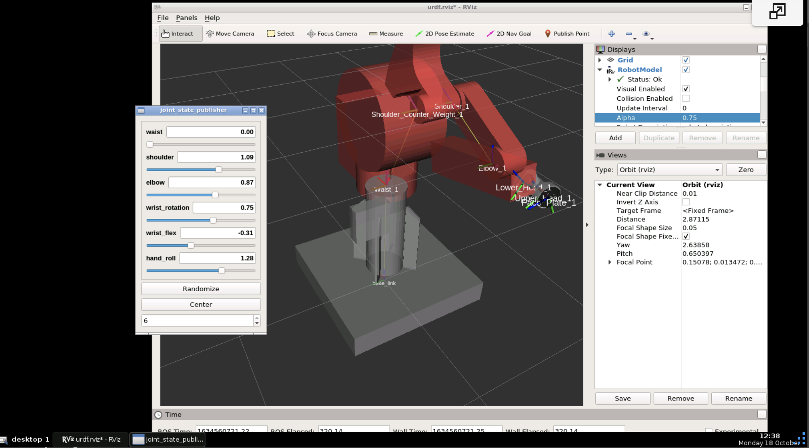

# MR6500 Repair and Control
### October 17th, 2021
#### by: Nile Walker

## Current Status
### **Simulation**


The mesh and joint description files for robot simulation have been built up in Fusion 360 and exported into URDF using the [fusion2urdf](https://github.com/syuntoku14/fusion2urdf) add-on project. Adding part colors and the switch from effort control interface to position control interface we're done manually after the fact. The files necessary to launch the view shown above and the gazebo simulation for a path testing are in the merlin_description package.

### **Planning**


 The robot is configured to use the ROS MoveIt package for path planning, using a controller type of joint_trajectory_controller we're able to send a list of intermediate states that the robot must achieve before reaching its final position, that allows us to do self-collision avoidance, obstacle avoidance and constrain certain types of motion i.e. holding a cup and not tipping it over as you move between points. These goal states can be described in python scripts or by running the ```merlin_moveit_config/launch/demo.launch``` file and dragging the robot around in the RVIZ GUI.
 
### **Real World Control**


The arm is controlled using an Arduino Mega 2560 which controls the pulse and direction pins of my 3 TB6600 stepper drivers and publishes the positions of all 6° of freedom but is currently only capable of controlling the first 3 as I've run out of stepper drivers. The node for interfacing with the arduino is in ```merlin_hardware_interface/launch/controllers.launch``` along with the accompanying arduino code here ```merlin_hardware_interface/arduino/arduino.ino```

The entire set up is powered by the 2 12 V lines of a 500 watt desktop power supply with the green power on signal line shorted to ground semi-permanently with a thick wire. 

## Things to do next:
### The Power
With our current 12 V supply we can step each motor once every 3 ms without losing steps. I have experimentally found that it takes about 9666 steps per revolution of each of the major joints that is around 28.9 seconds per full rotation of a joint. It seems the industry standard is to run stepper motors at 24 or 48 V to get faster speeds reliably but I currently have neither a 24 or 48 V supply to test with.

### The Brakes


The robot has no means of absolute position measuring, so once calibrated it needs the software to count each rotation of the motors to predict its current position. This meaning the arm cannot be allowed to move when the controller is off, our setup achieves this by using 3 ER-225 electric brakes on the waist, shoulder and elbow joints to hold the arms position when off. 
    
The issue is these brakes have an internal resistance of around 630 ohms so in order to release them using the recommended 14 watts we need around an 80 V supply. That being much more than the current 12 V supply we will need some sort of voltage booster to use them. I've listed one that I think is appropriate at the bottom of this update.

### The Encoders
In order to more accurately measure position and account for step loss when it occurs, We use a set of 6 HEDS 6310 high resolution encoders to provide feedback. ``` Note: The one for the shoulder joint is missing```. We can't currently interface with those sensors as if we were to plug one directly into the Arduino the high rate at which it would need to read from the multiple sensors would harm normal operation. 

The solution is to instead use a dedicated circuit for decoding the encoders like the LS7366R 32-bit quadrature counter. I've linked to a board capable of using that chip below but its rather expensive and simple so I'd like to purchase one and familiarize myself with it and the encoders then order a custom PCB that has all 6 built into one.

### The Gripper
Here we can just almost get away with a simple servo powered gripper, but since the end goal of this project is a pick and place task it'll be very useful to add some sort of robot perception for identifying target objects I've listed a usb webcam and a usb extender below.  

### The Wrist 


The wrist of this robot can be considered a differential joint, in that its position is determined by the combined motion of two separate motors. This makes controlling the joints slightly more complicated and that we can't just solve for a necessary motor rotation in order to achieve a final joint position.

For right now we calculate the position of the head roll, wrist rotation and flex on the controller as we move each motor and then feed those back into the move it package. In a perfect world MoveIt would directly handle each of the motors rotation so that it can better understand the physical state of the robot as it travels, I'm in the process of figuring this out but as of right now I don't know if thats possible within the basic MoveIt package or if I'm internally overcomplicating the issue.

## Parts:
### DC-DC Step Up Transformer
* https://www.amazon.com/Yeeco-Adjustable-Transformer-Controller-Stabilizer/dp/B07568P3QL
### Stepper Drivers
* https://www.amazon.com/Usongshine-Stepper-Driver-Controller-Motor%EF%BC%883/dp/B088CRCMP7/ref=asc_df_B088CRCMP7/?tag=hyprod-20&linkCode=df0&hvadid=459709171878&hvpos=&hvnetw=g&hvrand=7093563557004326649&hvpone=&hvptwo=&hvqmt=&hvdev=c&hvdvcmdl=&hvlocint=&hvlocphy=1027158&hvtargid=pla-943727894599&psc=1
### LS7366R 32-bit quadrature counter
* https://www.mikroe.com/counter-click
### HEDS6310 Encoder
* https://www.ebay.com/itm/392163033060
### USB-Webcam
* https://www.amazon.com/Logitech-C270-720pixels-Black-webcam/dp/B01BGBJ8Y0/ref=sr_1_3?dchild=1&keywords=webcam&qid=1634565950&sr=8-3
### USB Extender
* https://www.amazon.com/Extension-AINOPE-Material-Transfer-Compatible/dp/B07ZV6FHWF/ref=sr_1_1_sspa?dchild=1&keywords=usb+extender&qid=1634566004&sr=8-1-spons&psc=1&smid=A3ISN3IGK0NJQ9&spLa=ZW5jcnlwdGVkUXVhbGlmaWVyPUExQlFDUkdOWDQ3N1E5JmVuY3J5cHRlZElkPUEwOTM0MDU1NVBVV1lXQVVSMklIJmVuY3J5cHRlZEFkSWQ9QTA1NzY1NDUxWllBQ0NWTUQyMUI5JndpZGdldE5hbWU9c3BfYXRmJmFjdGlvbj1jbGlja1JlZGlyZWN0JmRvTm90TG9nQ2xpY2s9dHJ1ZQ==