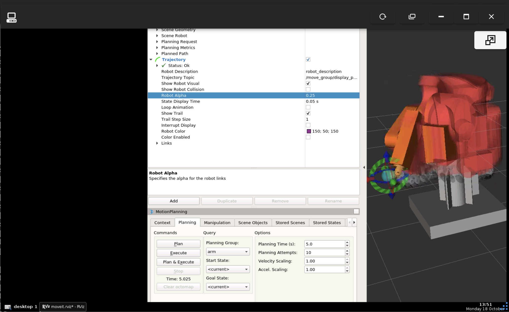

# Enabling Robotic Automation at Staunton Makerspace

Robotic machining can be highly flexible because robots can be adjusted for a variety of machining processes by changing the end-effectors or tools attached to the manipulator. As robotic machining systems have more DOF than machine tools, more complex parts can be machined. Since work on the Merlin MR6500 Arm in the shop has gone well its become a realistic capability if we want to pursue it. 

## Potential Uses:

This arm is hefty and theres almost no handheld tool you couldn't stick to it. 
* Large Scale 3D Printing 
* Photogrammetry
* Astrophotography
* Automated 
  * Welding
  * Machining 
  * Painting
  * Assembly
  
The arm also doesn't just have to be a tool. It's a cool piece of technology and it might be useful to just have it wave a sign, be interactive, or serve drinks at an event.

## Current Abilities

### Offline Programming
Using ROS + MoveIt, it's possible to set goal states in the GUI by dragging a virtual arm or sending cartesian positions to the planner through something like a python script. The arm will then approach this target position while checking to see if it's going to hit itself. 

### Degrees of Freedom
Right now we have control of the three major axes using 3 of the 12 V stepper drivers that I had on hand. These 3 axes are waist rotation, shoulder rotation and elbow rotation.

## Current Limitations
### Degrees of Freedom
Right now we have control of the three major axes using 3 of the 12 V stepper drivers that I had on hand. These 3 axes are waist rotation, shoulder rotation and elbow rotation.
### Offline Programming
ROS is very useful but it's meant for development and not a user facing tool. Setting up new tool attachments is an involved process and documentation on how to do so is limited and oriented more towards those already familiar with ROS. Also there's no standardized way to communicate between ROS and CAM. So to actually allow this to be accessible as a tool we would need to buy a license to dedicated robot programming software. Which is at this point the most expensive part.

## Current Plan
  1. Upgrade the power supply to a 48V Supply that can better leverage the capabilities of the motors. 
  2. Add stepper drivers for the 3 wrist axes.
  3. Switch from counting steps to reading from the joint encoders to improve accuracy and reliability. Plus I'd like to add limit switches for homing the arm.
  4. Reinstall the brakes for the 3 major axis.
  5. Set up an enclosure to better manage the power supply, emergency shutoff, stepper drivers and cabling. 
  6. At this stage we should have a fully working and cleaned up arm so I plan to go back into ROS and set up some milling tests with basic shapes and python. This should allow me to confirm the accuracy of my 3D models and determine the accuracy limitations of the arm.
  7. Use the free trials to evaluate dedicated off-line programming softwares.

## Notes
  * The arm did come with a pneumatic tool change system. In the long term it might be useful to get this up and running again so that jobs can be run with multiple tools. But I'm not super with these types of systems and I do think that actually utilizing the tool change feature would be complicated process to get setup that I wouldn't bother undertaking unless explicitly necessary.

## [Parts List](https://docs.google.com/spreadsheets/d/1EjQkyqkRLtM95hAEB7xOX4P-yniZp_DnrhcI5OFt3fY/edit?usp=sharing)
